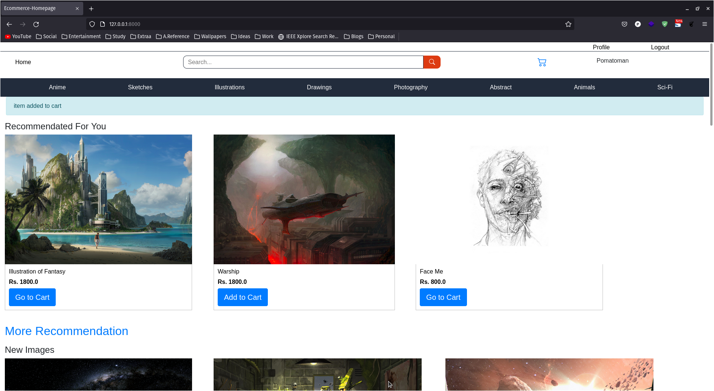
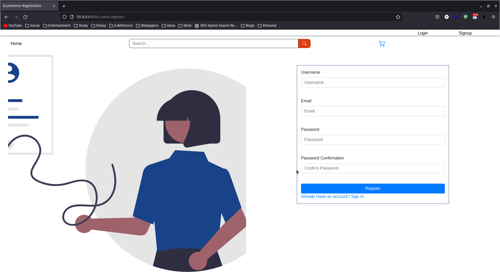
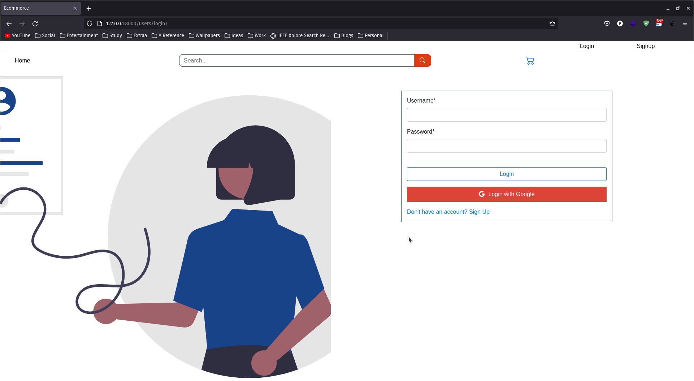
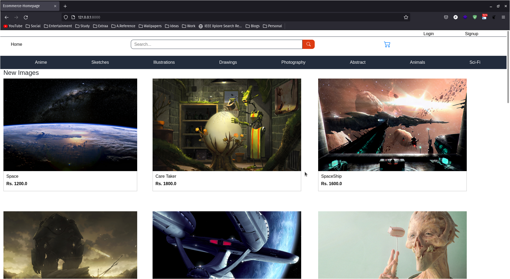
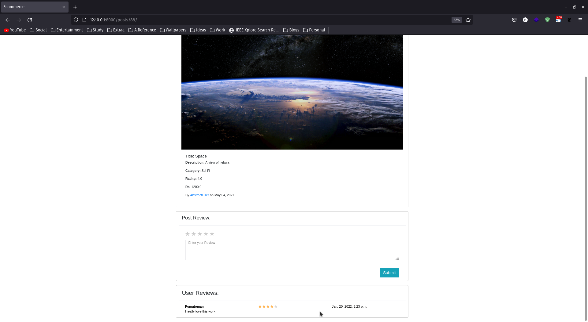
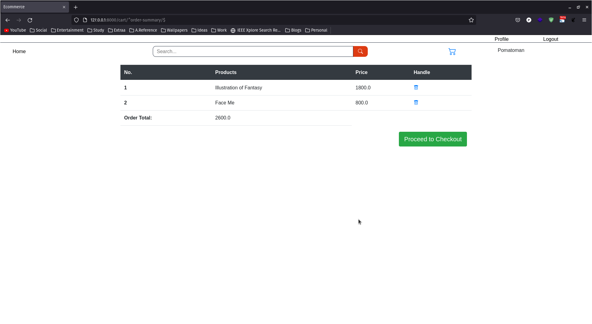

# Image Ecommerce Using Django with Recommendation



## Before you start

> python version 3.8+

### __Installing packages__

first the requirement directory
```
cd Ecommerce/ecommerce

```
then.

```
pip3 install -r requirement.txt

```

for some devices this doesn't help so install the following packages individually.

``` 
pip3 install (the following individually)

* django
* numpy
* pandas
* scikit-learn
* django-cleanup
* django-sass-processor
* django-mptt
* django-libsass
* django-compressor
* django-crispy-forms
* django-allauth
* Pillow


```

---

Here, are some demo pages

SignUp



SignIn



Homepage



Logged In Homepage 


Post Detail



Cart



---

## About Recommendation System
### __Content-Based-Recommendation with TF/IDF__

The recommendation uses the description and title from each post, processes TF/IDF and uses it to calculate the cosine-similarity of each post.

The recommendation right now does not start until and unless the user provides a rating/review to the post in question. The rated start should be 3 or above.
